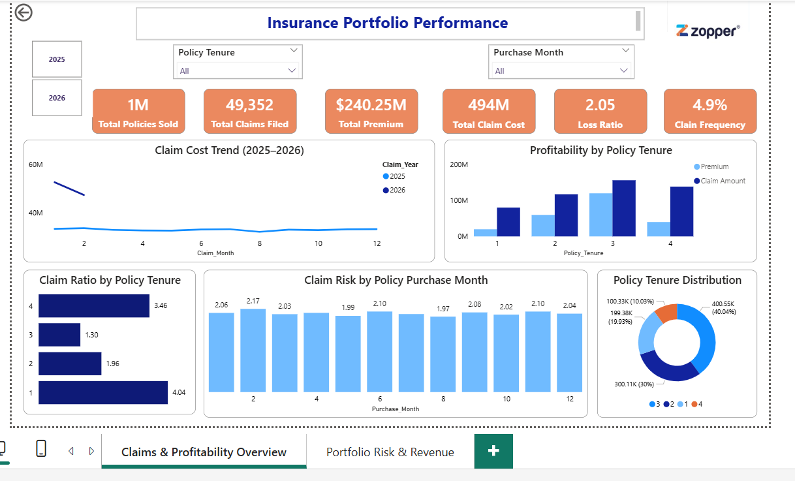
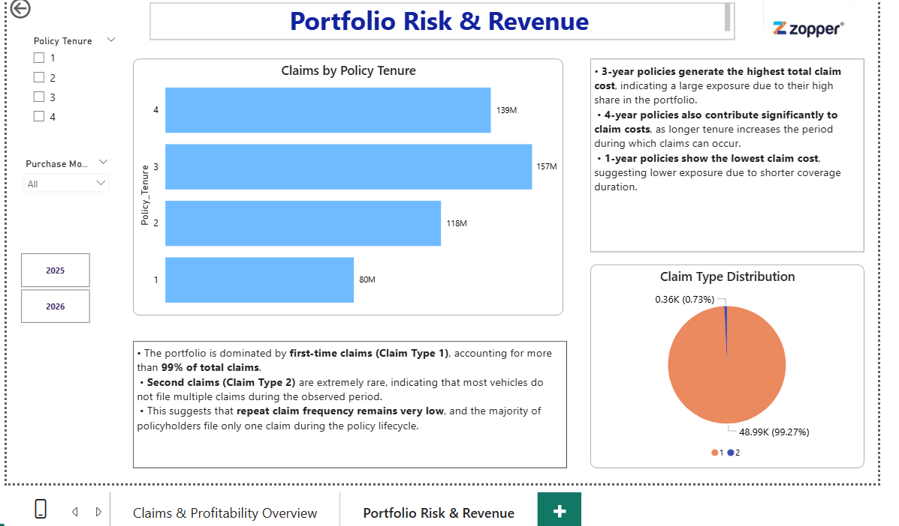
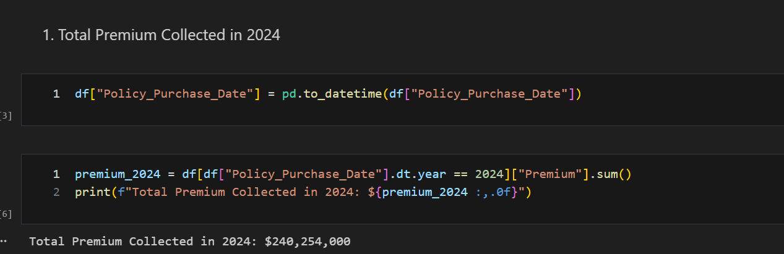
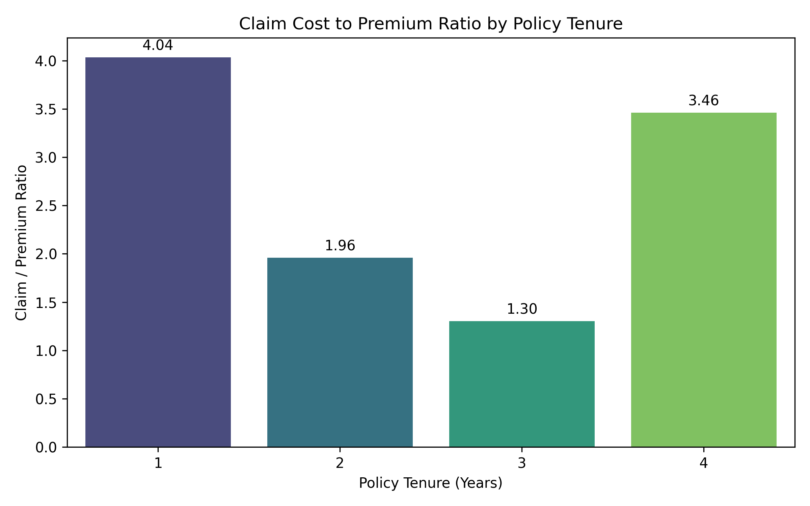
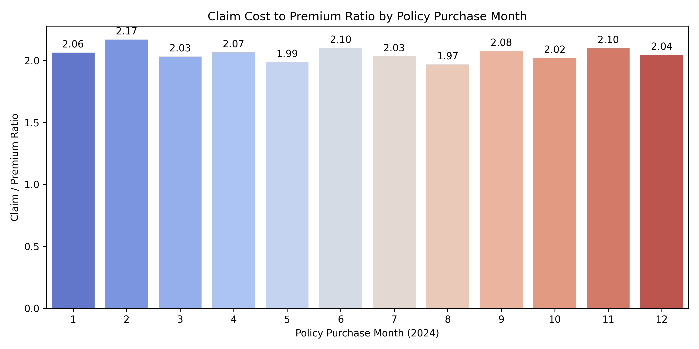
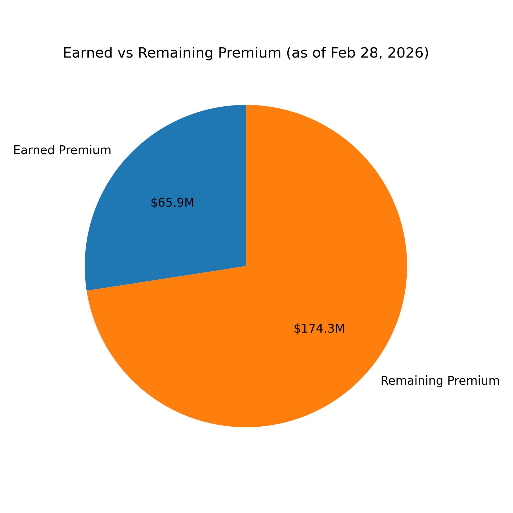

# 📊 Insurance Portfolio Risk & Profitability Analytics

An end-to-end data analytics project analyzing insurance portfolio profitability, claim exposure, and risk distribution using Python, Pandas, and Power BI.

This project simulates a real-world insurance analytics scenario where an insurer evaluates policy performance, claim behavior, and financial risk to improve pricing strategy and portfolio profitability.

## 📊 Power BI Dashboard

  

  

The interactive dashboard tracks key insurance KPIs including:

-Total Premium Revenue
-Total Claim Cost
-Loss Ratio
-Claim Frequency
-Claim Trends by Month
-Risk Exposure by Policy Tenure

## 🧠 Business Context

Insurance companies must constantly evaluate the financial performance of their policy portfolios.
A key metric used in the industry is the Loss Ratio, defined as:

Loss Ratio = Total Claims / Total Premium

A high loss ratio indicates that claim payouts exceed premium revenue, which can lead to financial losses for the insurer.
However, analyzing large insurance datasets across policies and claims can be challenging.
This project builds a data-driven insurance analytics framework that helps insurers understand claim patterns, evaluate profitability, and identify risk factors in their portfolio.

## 🎯 Business Impact

The analysis revealed several important insights about the simulated insurance portfolio.

1. Portfolio Loss Ratio

-The overall portfolio shows a loss ratio of approximately 2.05, meaning total claims are more than double the premium revenue collected.
-This indicates that the simulated insurance portfolio is currently unprofitable.

2. Claim Frequency

-Only 4.9% of vehicles have filed claims, while 95.1% remain potential claims.
-This suggests that the insurer still carries significant future claim liability during the remaining policy tenure.

3. Policy Tenure Profitability

Policy tenure significantly affects portfolio profitability.
The analysis shows:

-3-year policies are the most profitable
-1-year policies show the highest loss ratio
-4-year policies carry high claim exposure

## 🛠 Tech Stack
-Data Simulation
-Python
-NumPy
-Data Processing
-Python
-Pandas

Data Analysis
-Jupyter Notebook

Data Visualization
-Power BI
-Matplotlib

Development Environment
-VS Code
-Git
-GitHub

## ⚙️ Data Pipeline & Workflow
Data Simulation

A Python pipeline was built to simulate large-scale insurance datasets.

Scripts used:

1.policy_sales_generation.py
2.claims_data_generation.py
3.prepare_insurance_dataset.py

The pipeline:

-Generates policy sales data
-Simulates insurance claims using business rules
-Cleans and integrates datasets
-Exports the final analytical dataset

# 📂 Dataset Creation

Two main datasets were generated:

## 1️⃣ Policy Sales Dataset

Represents vehicle insurance policies purchased during **2024**.

### Key Characteristics

- **1,000,000 policies simulated**
- Each record represents a **unique vehicle and customer**
- Vehicle value assumed: **₹100,000**

### Policy Tenure Distribution

| Tenure | Distribution |
|------|------|
| 1 Year | 20% |
| 2 Years | 30% |
| 3 Years | 40% |
| 4 Years | 10% |

### Premium Calculation Rule

Premium = Policy_Tenure × 100

---

## 2️⃣ Claims Dataset

Simulates insurance claims filed against policies based on predefined rules.

### Dataset Fields

- Claim_ID  
- Customer_ID  
- Vehicle_ID  
- Claim_Amount  
- Claim_Date  
- Claim_Type  

### Claim Amount Rule

Claim Amount = 10% of Vehicle Value

### Claim Simulation Rules

Claims were generated according to business logic.

#### For 2025

- Vehicles purchased on the **7th, 14th, 21st, and 28th** of each month were eligible for claims.
- **30% of these vehicles** filed a claim.

#### For 2026

- Additional claims generated between **Jan 1 – Feb 28**
- **10% of vehicles with 4-year tenure filed claims**
- Vehicles with a previous claim could file a **second claim**

---

# 🔗 Data Integration

After generating the datasets, they were merged to create a unified analytical dataset.

### Join Details
Join Type : Left Join
Join Key : Vehicle_ID

This ensures all policies remain in the dataset, including vehicles without claims.

### Final Dataset Export

cleaned_insurance_analytics.csv

---

# 🧹 Data Cleaning

Before analysis, the dataset was validated by:

- Removing duplicate columns  
- Handling missing claim values  
- Converting date columns  
- Verifying dataset integrity  
- Validating claim distribution  

Missing claim amounts were replaced with **0 for non-claim vehicles**.
---

# ⚙️ Feature Engineering

Additional analytical variables were created:

- **Claim_or_Not** → Binary indicator (1 = claim)  
- **Purchase_Month** → Month of policy purchase  
- **Claim_Year** → Claim year  
- **Claim_Month** → Claim month  
- **Tenure_Days** → Policy tenure converted to days  

Tenure_Days = Policy_Tenure × 365

---

# 📊 Analytical Questions Solved

This project answers several key business questions.

---

### 1️⃣ What is the total premium collected in 2024?

---

### 2️⃣ What are the monthly claim costs in 2025 and 2026?

---

### 3️⃣ Which policy tenure has the highest claim-to-premium ratio?

---

### 4️⃣ Does the month of policy purchase affect claim risk?

---

### 5️⃣ What is the potential future claim liability if all remaining vehicles claim once?

---

### 6️⃣ How much premium has been earned vs remaining?

---

# 📊 Exploratory Data Analysis

Exploratory analysis was performed using **Python (Pandas & NumPy)**.

### Key Visualizations

These analyses help identify patterns in:

- Claim frequency
- Premium distribution
- Risk exposure by policy tenure

---

# 📊 Power BI Dashboard

An interactive Power BI dashboard was built to analyze portfolio performance.

### Dashboard File
Insurance_Analysis_Dashboard.pbix

### Dashboard Features

- Premium vs Claim analysis  
- Loss ratio monitoring  
- Claim trends by month  
- Policy tenure profitability  
- Claim type distribution  

---

# 🚀 Business Recommendations

### Pricing Optimization
Policies with higher claim exposure (especially **1-year and 4-year tenures**) should have adjusted premium pricing.

### Risk Monitoring
Insurance providers should continuously monitor **long-tenure policies** to reduce future claim exposure.

### Predictive Risk Modeling
Machine learning models can be implemented to **predict claim probability** and improve underwriting decisions.

### Portfolio Risk Monitoring
Tracking claim trends over time helps insurers **identify emerging risk patterns early**.

### Balanced Policy Portfolio
Encouraging a mix of policy tenures helps maintain a **balanced risk profile**.

---

# 👩‍💻 Author

**Mahak Bisht**  
Aspiring **Data Analyst / Business Analyst**

### Skills

- SQL  
- Python  
- Power BI  
- Data Analytics  
- Business Intelligence  

📧 **Email**  
mahak.bisht2003@gmail.com  

🔗 **LinkedIn**  
https://www.linkedin.com/in/mahak-bisht-79241528a  

🔗 **GitHub**  
https://github.com/mahakb2003
